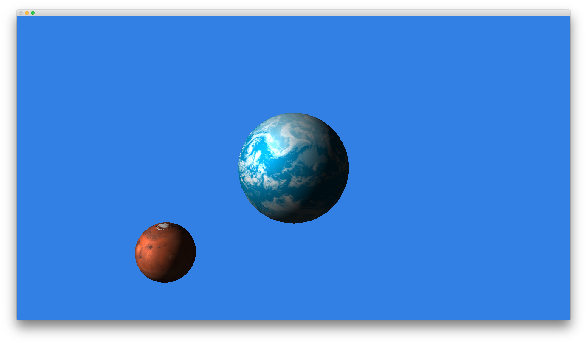
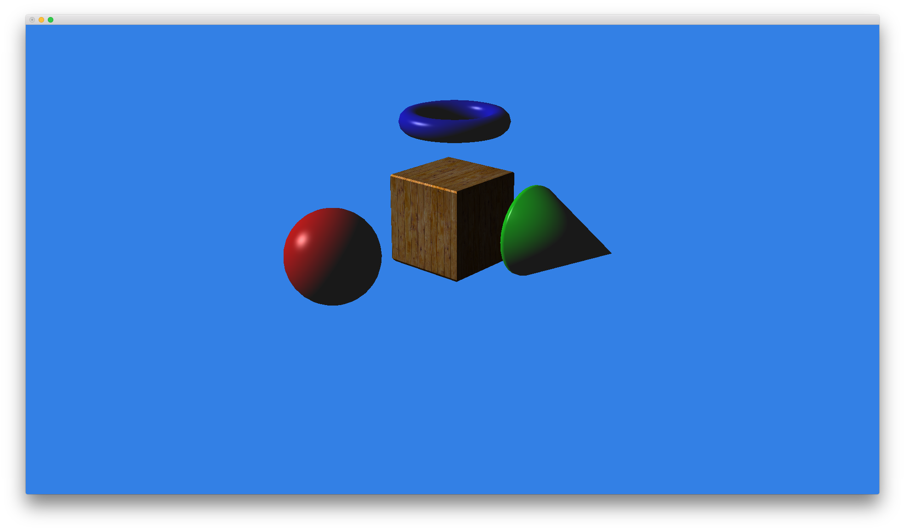

# Overview
I-Cube 3D Engine (IcEng) is an open source, light weight OpenGL/C++ 3D graphics Engine. It's designed with simple structure and interface to fit small cross platform 3D application. It can also serve as OpenGL example, or foundation code base that you can develop your own 3D engine upon.
The source or binary are provided with free BSD license, so you can use this engine on personal or commercial project with no restriction. See License section.
For more information check website http://www.simviu.com/dev.

#Features
* C++ 0x11 code, OpenGL 2.0 shader.
* Cross Platform ( Mac/Windows/Linux/iOS/Android ), project file provided.
* Auto memory and resource management with C++ 0x11 std::shared_ptr.
* Model loading with Waveform .OBJ file. ( More format in future )
* Basic lighting, material.
* Abstract C++ wrapper class with OpenGL function hidden.
* Support Google CardBoard VR.(Coming soon...)

#TODO
* Windows Visual C++ project file need fix
* Android GL context re-creation issue
* Google Cardboard VR add-on
* More doucuments
* Some other issues

#Architecture
* The IcEng applications are wrapped in IcApp/IcWindow/IcScene structure. 
* There is only one IcApp instance(singleton). 
* An IcApp application can contain several IcWindow. 
* Each window has it's own OpenGL context. 
* Each window has one or more IcScene. 
* Each IcScene contain one IcCamera, and many IcObject.
* An IcObject has it's IcModel, loaded from OBJ file or created dynamically.
* IcModel are constructed by IcMesh, IcTexture and IcMaterial.

In most case your simple 3d application has one IcWindow and one IcScene. For iOS/Android mobile App. There should only be one window.

#Document
More info check IcEng/doc/IcEng_Manual.pdf

#License
Check BSD license :
https://en.wikipedia.org/wiki/BSD_licenses

#Contact
support@simviu.com

#ScreenShots
| ...                                    | ...                                    |
| ---------------------------------------|:--------------------------------------:|
|       |       |
|       |       | 

